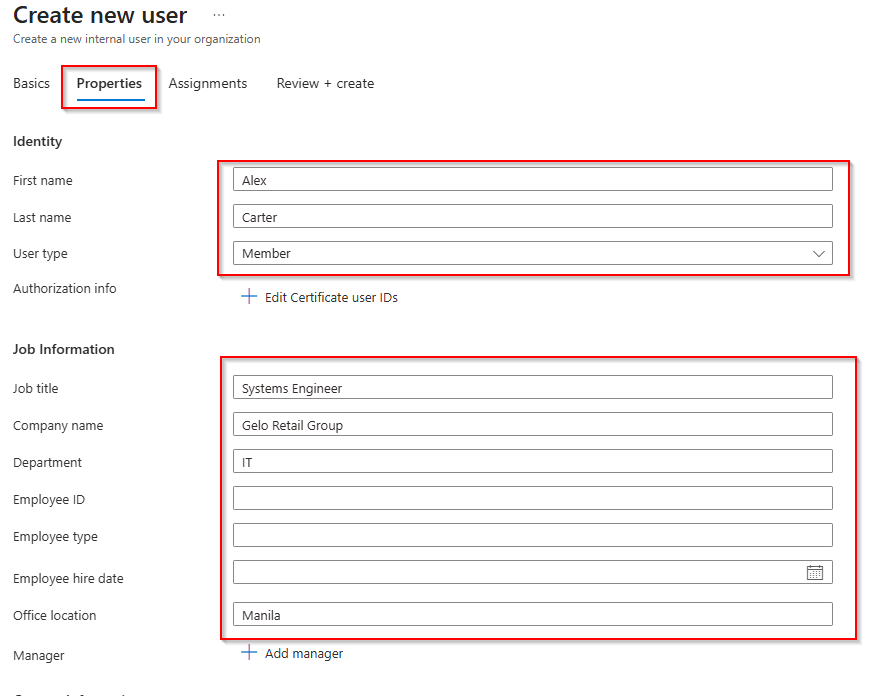
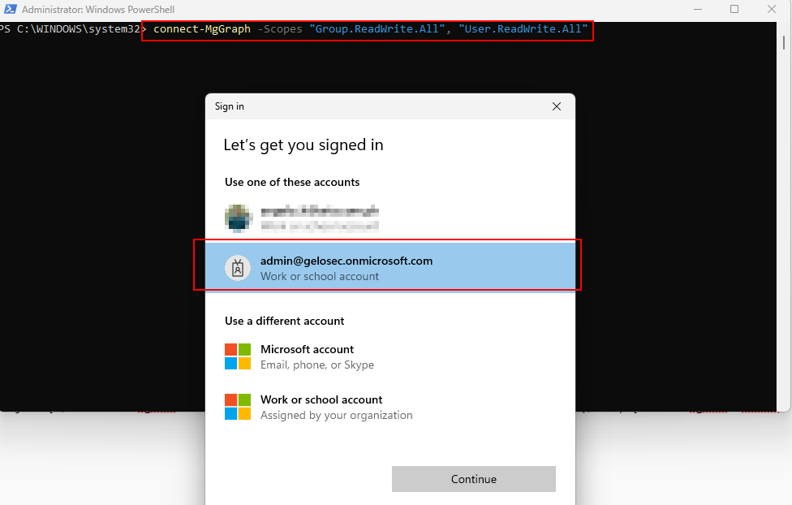
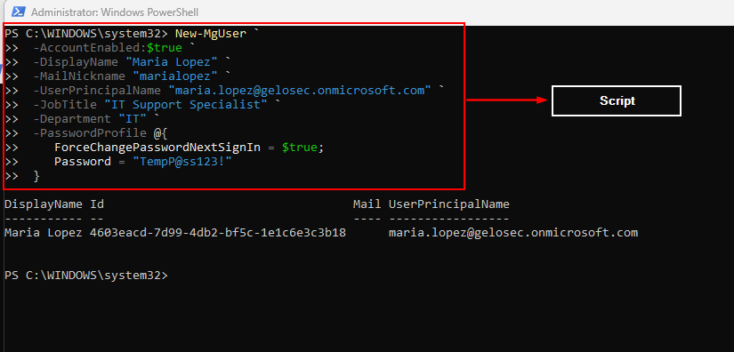
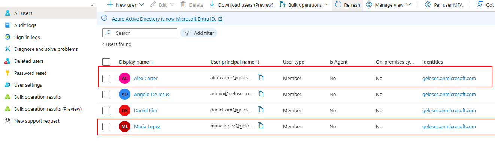
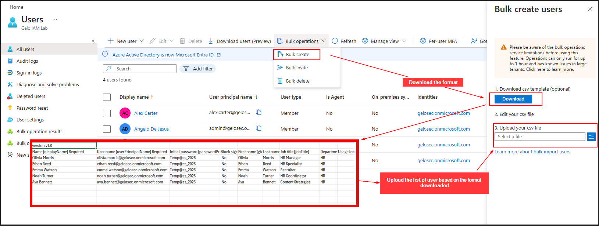
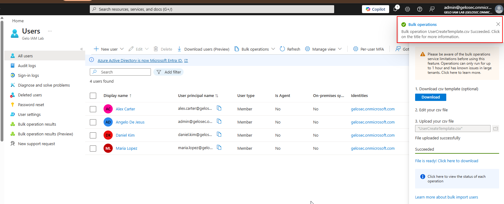
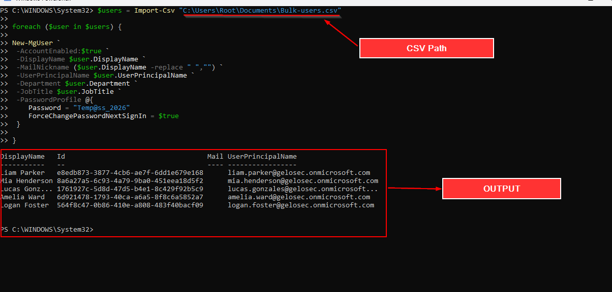
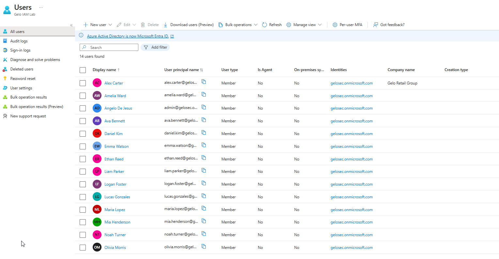

# Enterprise Identity Governance Lab – Microsoft Entra ID

This project demonstrates the implementation of identity governance practices using Microsoft Entra ID.  
The lab simulates an enterprise environment where identities are provisioned, managed, and governed using automated group membership, delegated administration, custom security attributes, and hybrid identity synchronization.

The goal of this project is to demonstrate how identity lifecycle management can be implemented in a modern cloud identity platform.

---

# Project Scenario

Gelo Retail Group is modernizing its identity infrastructure using Microsoft Entra ID while maintaining an on-premises Active Directory environment.

The organization requires:

- Centralized user provisioning
- Automated group membership
- Delegated administration
- Identity classification
- Secure deprovisioning processes
- Hybrid identity synchronization

This project demonstrates how these requirements can be implemented using Microsoft Entra ID.

---

# Architecture Overview

The following diagram illustrates the identity governance flow implemented in this lab.


Flow Overview

HR Dataset / CSV  
↓  
User Provisioning (GUI + PowerShell)  
↓  
Group Governance (Assigned + Dynamic Groups)  
↓  
Administrative Units (Delegated Administration)  
↓  
Custom Security Attributes (Identity Classification)  
↓  
User Deprovisioning  
↓  
Hybrid Identity Synchronization


---

# Dataset

The environment uses a sample dataset representing employees across multiple departments.

Departments included:

- Executives
- IT
- HR
- Finance
- Sales

Each user includes attributes used for identity governance:

- Display Name
- Job Title
- Department
- User Principal Name


---

# Identity Provisioning

Users are provisioned using two methods:

- Microsoft Entra Admin Center (GUI)
- Microsoft Graph PowerShell

This demonstrates both manual and automated identity provisioning workflows.

---

## User Provisioning – GUI

Users were provisioned with department attributes to support dynamic group membership and automated access assignment.



## Must do before using PowerShell for provisioning
You must do the following first before you start provisioning users using PowerShell:
- Bypass Execution Policy
- Installs the base Microsoft Graph PowerShell module
- Connects to Microsoft Graph

[View Script](Script/MUST-DO-FIRST.txt)

You need to sign in using your Microsoft account



## User Provisioning – PowerShell



[Create individual User](Script/Create-Individual-User.txt)

### Understanding the Script Components

| Component | Explanation | Example |
|-----------|-------------|---------|
| Cmdlet | PowerShell command that follows a Verb-Noun format | `New-MgUser` |
| Parameter | Tells the command how to behave or what data to use | `-DisplayName` |
| String | Text value usually passed to parameters | `"Elon Musk"` |
| Boolean Value | Represents true or false | `$true` |
| Hashtable | Data structure that stores key-value pairs | `@{ Password = "123"; ForceChangePasswordNextSignIn = $true }` |

As per checking in Entra ID, the user was added



## Bulk User Provisioning

Users were provisioned in bulk using both GUI-based CSV upload and PowerShell automation.

### GUI Bulk Creation

Microsoft Entra ID has its own CSV file format, where you can download and input the user information and upload it after the list is created.



You can see the prompt when bulk operations are successful.



### PowerShell Automation

Take note that when we are uploading a csv file using PowerShell, we must use the CSV specifically for PowerShell automation. Not the Microsoft Entra Bulk Template format. You can see sample csv file below:

- [PowerShell Format](Dataset/Bulk-users.csv)
- [Entra Bulk Format](Dataset/UserCreateTemplate.csv)



[View Script](Script/Bulk-User-Creation.txt)

## PowerShell Script Breakdown

This script creates multiple users in Microsoft Entra ID by reading user information from a CSV file and using Microsoft Graph PowerShell.

### 1. Import CSV Dataset

```powershell
$users = Import-Csv "C:\Users\Root\Documents\Bulk-users.csv"
```

Reads user data from the CSV file and stores it in the `$users` variable.

---

### 2. Loop Through Each User

```powershell
foreach ($user in $users) {
```

Iterates through each row in the CSV file so a user account can be created for every entry.

---

### 3. Create the User

```powershell
New-MgUser `
```

Creates a new user in Microsoft Entra ID using Microsoft Graph.

---

### 4. Enable the Account

```powershell
-AccountEnabled:$true
```

Ensures the user account is active after creation.

---

### 5. Set User Attributes

```powershell
-DisplayName $user.DisplayName
-UserPrincipalName $user.UserPrincipalName
-Department $user.Department
-JobTitle $user.JobTitle
```

Assigns user profile attributes based on values from the CSV file.

---

### 6. Generate Mail Nickname

```powershell
-MailNickname ($user.DisplayName -replace " ","")
```

Creates a mail nickname by removing spaces from the display name.

Example:

```
Maria Lopez → MariaLopez
```

---

### 7. Set Password Profile

```powershell
-PasswordProfile @{
   Password = "Temp@ss_2026"
   ForceChangePasswordNextSignIn = $true
}
```

Assigns a temporary password and forces the user to change it during the first login.

---

### Result

The script automatically provisions multiple user accounts in Microsoft Entra ID using data from the CSV dataset.

# User Creation Validation

After running the PowerShell provisioning script, the newly created users were verified in Microsoft Entra ID.



