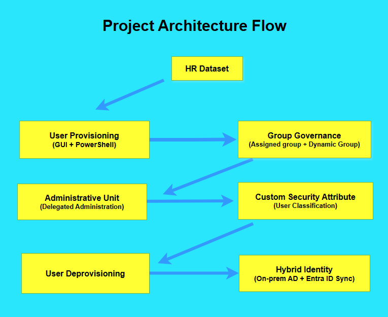
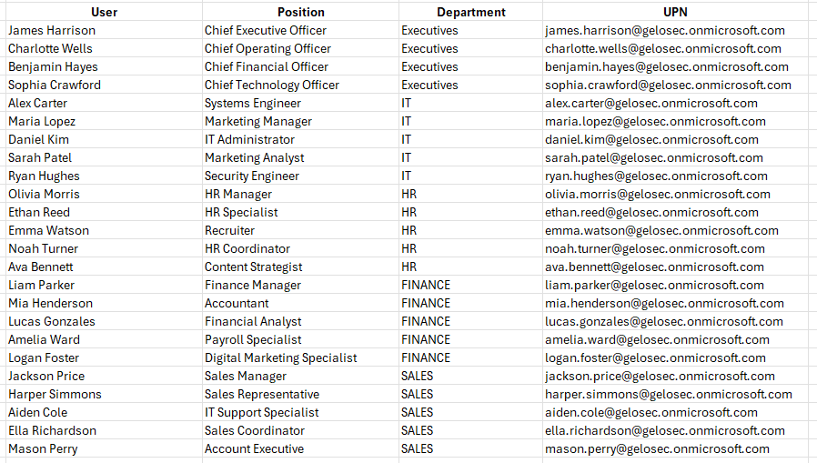

# Enterprise Identity Governance Lab – Microsoft Entra ID

This project demonstrates the implementation of identity governance practices using Microsoft Entra ID.  
The lab simulates an enterprise environment where identities are provisioned, managed, and governed using automated group membership, delegated administration, custom security attributes, and hybrid identity synchronization.

The goal of this project is to demonstrate how identity lifecycle management can be implemented in a modern cloud identity platform.

---

# Project Scenario

Gelo Retail Group is modernizing its identity infrastructure using Microsoft Entra ID while maintaining an on-premises Active Directory environment.

The organization requires:

- Centralized user provisioning
- Automated group membership
- Delegated administration
- Identity classification
- Secure deprovisioning processes
- Hybrid identity synchronization

This project demonstrates how these requirements can be implemented using Microsoft Entra ID.

---

# Architecture Overview

The following diagram illustrates the identity governance flow implemented in this lab.

Flow Overview

HR Dataset / CSV  
↓  
User Provisioning (GUI + PowerShell)  
↓  
Group Governance (Assigned + Dynamic Groups)  
↓  
Administrative Units (Delegated Administration)  
↓  
Custom Security Attributes (Identity Classification)  
↓  
User Deprovisioning  
↓  
Hybrid Identity Synchronization

---

# Dataset

The environment uses a sample dataset representing employees across multiple departments.

Departments included:

- Executives
- IT
- HR
- Finance
- Sales

Each user includes attributes used for identity governance:

- Display Name
- Job Title
- Department
- User Principal Name

